# Feature Specification: Automated Application Assembly

**Feature Branch**: `002-automated-app-assembly`
**Created**: 2026-02-13
**Status**: Draft
**Input**: User description: "Eliminate the toil for developers to set up Radius and its artifacts by automating application assembly — covering repo analysis, runtime targeting, infra provisioning, artifact build/publish, deployment code authoring, config/secrets wiring, traffic/security setup, observability, compliance gates, and deploy/validate/iterate cycles."

## Assumptions

- The target user is an enterprise developer or platform engineer already using (or evaluating) Radius.
- "Application assembly" refers to the full lifecycle from source repo to running, observable, secured deployment — not just container image creation.
- The system leverages Radius's existing abstractions (Applications, Environments, Recipes, Application Graph) rather than inventing parallel concepts.
- Standard web/mobile/microservice application patterns are the primary target; exotic runtimes (mainframes, embedded) are out of scope.
- The system operates as an interactive workflow (not fully unattended) so users can confirm decisions at key checkpoints.
- Existing CI/CD pipelines (e.g., GitHub Actions) are complemented, not replaced — the system generates artifacts that integrate into those pipelines.
- Authentication and identity follow Radius's existing credential model; no new identity provider integration is introduced in the initial scope.

## User Journey Overview

The flow below shows the end-to-end developer experience from source repository to production-ready application. Each phase maps to a user story (US1–US6). The developer stays in control at every checkpoint (marked with ✋); the system handles the automation in between.

```mermaid
flowchart TB

%% =====================================================
%% HEADER
%% =====================================================

A([<b>🚀 Automated Application Assembly</b><br/>Source Repo → Production App]):::start

%% =====================================================
%% P1 CORE
%% =====================================================

subgraph P1["<b>🎯 P1 — CORE</b>&ensp;Minimum Viable Product"]
direction TB

U1["<b>❶ DISCOVER & ANALYZE</b> · US1
━━━━━━━━━━━━━━━━━━━━━━
🧑‍💻 Developer → Provide repo URL/path
⚙️ System → Scan languages & deps
⚙️ System → Detect existing artifacts
⚙️ System → Map service topology
━━━━━━━━━━━━━━━━━━━━━━
📦 <i>Output: Application Profile</i>
✋ <b>Checkpoint:</b> Review & confirm"]:::core

U2["<b>❷ GENERATE APP DEFINITION</b> · US2
━━━━━━━━━━━━━━━━━━━━━━
⚙️ System → Generate Radius Bicep model
🧑‍💻 Developer → Request changes
⚙️ System → Merge with existing defs
━━━━━━━━━━━━━━━━━━━━━━
📦 <i>Output: Radius App Definition</i>
✋ <b>Checkpoint:</b> Confirm definition"]:::core

U1 --> U2
end

%% =====================================================
%% P2 DEPLOY
%% =====================================================

subgraph P2["<b>🏗️ P2 — DEPLOY</b>&ensp;Code → Running App"]
direction TB

U3["<b>❸ PROVISION ENVIRONMENT</b> · US3
━━━━━━━━━━━━━━━━━━━━━━
🧑‍💻 Developer → Choose cloud & tier
⚙️ System → Create Radius Environment
⚙️ System → Provision via Recipes
&emsp;&emsp;&emsp;(DB · cache · queue · secrets)
━━━━━━━━━━━━━━━━━━━━━━
📦 <i>Output: Provisioned Environment</i>
✋ <b>Checkpoint:</b> Verify resources"]:::deploy

U4["<b>❹ BUILD, PUBLISH & DEPLOY</b> · US4
━━━━━━━━━━━━━━━━━━━━━━
⚙️ System → Build container images
⚙️ System → Push to registry
⚙️ System → Generate deploy plan
✋ <b>Checkpoint:</b> Review plan
⚙️ System → Deploy to environment
━━━━━━━━━━━━━━━━━━━━━━
📦 <i>Output: Running Application</i>
✋ <b>Checkpoint:</b> Verify endpoints"]:::deploy

U3 --> U4
end

%% =====================================================
%% P3 HARDEN
%% =====================================================

subgraph P3["<b>🛡️ P3 — HARDEN</b>&ensp;Running App → Production Ready"]
direction TB

U5["<b>❺ WIRE CONFIG & SECRETS</b> · US5
━━━━━━━━━━━━━━━━━━━━━━
⚙️ System → Inject connection strings
⚙️ System → Wire service discovery
⚙️ System → Mount secrets from store
━━━━━━━━━━━━━━━━━━━━━━
📦 <i>Output: Connected Application</i>
✋ <b>Checkpoint:</b> Verify connectivity"]:::harden

U6["<b>❻ OBSERVABILITY & COMPLIANCE</b> · US6
━━━━━━━━━━━━━━━━━━━━━━
⚙️ System → Configure logs & traces
⚙️ System → Run security scans
⚙️ System → Generate compliance report
━━━━━━━━━━━━━━━━━━━━━━
📦 <i>Output: Dashboards + Report</i>
✋ <b>Checkpoint:</b> Review findings"]:::harden

U5 --> U6
end

%% =====================================================
%% FLOW CONNECTIONS
%% =====================================================

A --> U1
U2 -->|"app definition ready"| U3
U4 -->|"app deployed"| U5

Z([<b>✅ Production-Ready Application</b><br/>Connected · Observable · Compliant]):::finish

U6 --> Z

%% =====================================================
%% STYLES
%% =====================================================

classDef start fill:#4A90D9,stroke:#2C5F8A,color:#fff,font-size:14px
classDef finish fill:#2ECC71,stroke:#1A9C54,color:#fff,font-size:14px
classDef core fill:#EBF5FB,stroke:#3498DB,color:#1B2631,stroke-width:2px
classDef deploy fill:#FEF9E7,stroke:#F39C12,color:#1B2631,stroke-width:2px
classDef harden fill:#F5EEF8,stroke:#8E44AD,color:#1B2631,stroke-width:2px

style P1 fill:#D6EAF8,stroke:#2980B9,stroke-width:2px,rx:12,color:#1B4F72,font-size:13px
style P2 fill:#FDF2E9,stroke:#E67E22,stroke-width:2px,rx:12,color:#784212,font-size:13px
style P3 fill:#EBDEF0,stroke:#9B59B6,stroke-width:2px,rx:12,color:#4A235A,font-size:13px

linkStyle 0,1,2 stroke:#7F8C8D,stroke-width:2px
linkStyle 3,4,5 stroke:#2C3E50,stroke-width:2px,stroke-dasharray:6
```

> **Legend**: ✋ = developer checkpoint · 🧑‍💻 = developer action · ⚙️ = system automation · 📦 = phase output · ❶–❻ = user story

---

## User Scenarios & Testing *(mandatory)*

### User Story 1 — Discover & Analyze Application Repository (Priority: P1)

A developer points the system at an application source repository. The system scans the repo and produces a structured application profile: detected languages/frameworks, existing build artifacts (Dockerfile, Helm charts, K8s YAML, Bicep, Terraform), runtime dependencies (databases, caches, queues, secrets), environment configuration files (.env, appsettings, etc.), and service topology (number of services, ports, inter-service references).

**Why this priority**: Everything downstream — provisioning, deployment, wiring — depends on accurate application understanding. Without this, every subsequent step requires manual input, which is exactly the toil being eliminated.

**Independent Test**: Point the system at a sample multi-service repo (e.g., eShop reference app) and verify the generated profile matches the known repo structure.

**Acceptance Scenarios**:

1. **Given** a Git repository URL or local path, **When** the system analyzes it, **Then** it produces an application profile listing all detected services, languages, frameworks, and infrastructure dependencies.
2. **Given** a repo with existing Dockerfiles and Helm charts, **When** the system analyzes it, **Then** those existing artifacts are recognized and flagged (not duplicated).
3. **Given** a monorepo with multiple services, **When** the system analyzes it, **Then** each service is identified separately with its own dependency set.
4. **Given** a repo with no recognizable build artifacts, **When** the system analyzes it, **Then** it reports the gap and suggests next steps (e.g., "No Dockerfile found — would you like to generate one?").

---

### User Story 2 — Generate Radius Application Definition (Priority: P1)

Using the application profile from US1, the system generates a Radius Application definition (Bicep/TypeSpec) that models the application's services, their dependencies, and the connections between them. The developer reviews and confirms the generated definition before proceeding.

**Why this priority**: The Radius Application definition is the central artifact that drives all subsequent automation. Together with US1 they form the minimal viable product.

**Independent Test**: Generate a Radius Application definition from a known profile and verify it compiles, matches the expected service topology, and can be deployed to a dev environment.

**Acceptance Scenarios**:

1. **Given** a completed application profile with two services and a database dependency, **When** the system generates the Radius definition, **Then** it produces valid Bicep/TypeSpec with Application, Container, and portable resource references.
2. **Given** a profile with existing Radius artifacts, **When** the system generates, **Then** it merges with (not overwrites) existing definitions and highlights conflicts.
3. **Given** a generated definition, **When** the developer requests changes (e.g., "add a Redis cache"), **Then** the system modifies the definition accordingly.

---

### User Story 3 — Provision Environment & Infrastructure (Priority: P2)

The system creates or selects a Radius Environment and provisions the required infrastructure dependencies (database, cache, queue, storage, secrets store) using Recipes. The developer chooses the target cloud/runtime (Kubernetes, Azure, AWS) and environment tier (dev/staging/prod), and the system handles resource provisioning through Radius's Recipe system.

**Why this priority**: With the application modeled (US1 + US2), the next highest-value step is standing up the infrastructure it depends on. This eliminates the most time-consuming manual provisioning work.

**Independent Test**: Select a dev environment with Kubernetes target, request a PostgreSQL database and Redis cache, and verify both are provisioned and accessible.

**Acceptance Scenarios**:

1. **Given** a Radius Application definition with a PostgreSQL dependency, **When** the developer selects "dev" environment on Kubernetes, **Then** the system provisions the database via the appropriate Recipe and returns connection information.
2. **Given** a target environment that already has matching resources, **When** the system provisions, **Then** it reuses existing resources rather than creating duplicates.
3. **Given** a provisioning failure (e.g., quota exceeded), **When** the system encounters the error, **Then** it provides an actionable message explaining the failure and suggested remediation.

---

### User Story 4 — Build, Publish & Deploy Application (Priority: P2)

The system builds container images for each service, publishes them to a registry, generates or updates the deployment configuration, and deploys the application into the provisioned environment. The developer confirms the deployment plan before execution.

**Why this priority**: This completes the "code to running app" journey and delivers the most tangible outcome. It depends on US1–US3 but is the step where the developer sees their app running.

**Independent Test**: Build and deploy a two-service app to a dev Kubernetes cluster and verify both services are running and reachable.

**Acceptance Scenarios**:

1. **Given** a Radius Application with provisioned environment, **When** the developer triggers deployment, **Then** container images are built, pushed to a registry, and the application is deployed with all connections wired.
2. **Given** a deployment in progress, **When** a build step fails, **Then** the system stops, reports the error with context (build log excerpt, failing service), and offers to retry or skip.
3. **Given** a successful deployment, **When** the developer asks for status, **Then** the system shows running services, endpoints, and health status.

---

### User Story 5 — Wire Configuration, Secrets & Connectivity (Priority: P3)

The system automatically wires environment variables, secret references, connection strings, and service discovery entries based on the application profile and provisioned resources. Secrets are stored in the environment's secret store; connection strings are injected as environment variables or mounted volumes as appropriate.

**Why this priority**: Config/secrets wiring is error-prone manual work and a frequent source of deployment failures. Automating it significantly reduces "works on my machine" issues.

**Independent Test**: Deploy an app with a database dependency and verify the connection string is correctly injected without manual env-var configuration.

**Acceptance Scenarios**:

1. **Given** a deployed service with a database dependency, **When** the system wires configuration, **Then** the connection string is injected as an environment variable referencing the secret store.
2. **Given** multiple services that need to discover each other, **When** the system wires connectivity, **Then** service discovery entries (DNS names or URLs) are configured automatically.
3. **Given** a secret value that changes (e.g., password rotation), **When** the system re-wires, **Then** it updates the reference without redeploying the application code.

---

### User Story 6 — Configure Observability & Compliance (Priority: P3)

The system sets up baseline observability (structured logging, metrics collection, distributed tracing) and runs security/compliance gates (container image scanning, policy checks) for the deployed application. Results are surfaced to the developer with actionable findings.

**Why this priority**: Observability and compliance are essential for production readiness but provide less immediate value than getting the app running. They are important polish for the full lifecycle.

**Independent Test**: Deploy an app and verify that logs are collected, a health dashboard is available, and an image scan report is generated.

**Acceptance Scenarios**:

1. **Given** a deployed application, **When** the system configures observability, **Then** structured logs, metrics, and traces are collected and accessible through a dashboard or query interface.
2. **Given** a built container image, **When** the system runs compliance gates, **Then** it produces a scan report with vulnerability findings categorized by severity.
3. **Given** a compliance gate failure (critical vulnerability), **When** the system reports it, **Then** the developer sees the specific finding, affected image layer, and recommended fix.

---

### Edge Cases

- What happens when the repository uses an unsupported language or framework? The system reports the gap, provides partial analysis for recognized components, and suggests manual steps for the unrecognized parts.
- What happens when the developer has no container registry configured? The system offers to use a default local/dev registry or prompts the developer to configure one before proceeding.
- What happens when infrastructure provisioning times out? The system retries with exponential backoff, then surfaces a timeout error with the resource name, provider, and elapsed time.
- What happens when the generated Radius definition has a naming conflict with existing resources? The system detects the conflict during generation and prompts the developer to rename or merge.
- What happens when the target environment has insufficient permissions? The system checks permissions before provisioning and reports specific missing roles/permissions with a remediation path.

## Requirements *(mandatory)*

### Functional Requirements

- **FR-001**: System MUST analyze a Git repository (local path or remote URL) and produce a structured application profile containing detected services, languages, frameworks, build artifacts, and infrastructure dependencies.
- **FR-002**: System MUST detect existing Radius, Kubernetes, Helm, Terraform, Bicep, and Docker artifacts in the repository and incorporate them into the profile rather than duplicating them.
- **FR-003**: System MUST generate a valid Radius Application definition (Bicep/TypeSpec) from the application profile that compiles without errors.
- **FR-004**: System MUST present the generated application definition to the developer for review and confirmation before proceeding.
- **FR-005**: System MUST support creating and selecting Radius Environments targeting Kubernetes, Microsoft Azure, and Amazon Web Services.
- **FR-006**: System MUST provision infrastructure dependencies (databases, caches, queues, storage, secrets) through Radius Recipes.
- **FR-007**: System MUST build container images for each detected service and publish them to a configured container registry.
- **FR-008**: System MUST deploy the assembled application to the target environment with all service connections wired.
- **FR-009**: System MUST inject configuration values, connection strings, and secret references into services automatically based on provisioned resources.
- **FR-010**: System MUST provide a confirmation checkpoint before each destructive or resource-creating operation (provisioning, deploying).
- **FR-011**: System MUST display actionable error messages that include what failed, why it failed, and what the developer can do to resolve it.
- **FR-012**: System MUST support incremental operation — running individual steps (analyze, generate, provision, build, deploy) independently without requiring the full pipeline.
- **FR-013**: System MUST configure baseline observability (structured logging, metrics, distributed tracing) for deployed applications.
- **FR-014**: System MUST run security scanning on built container images and report findings with severity levels.
- **FR-015**: System MUST integrate with existing CI/CD workflows by generating pipeline-compatible artifacts (e.g., GitHub Actions workflow files).

### Key Entities

- **Application Profile**: The structured output of repository analysis — contains service inventory, dependency graph, detected artifacts, language/framework metadata. Created once per analysis, updated on re-scan.
- **Radius Application Definition**: The Bicep/TypeSpec file(s) modeling the application's services, connections, and resource dependencies. Generated from the profile, editable by the developer.
- **Environment Configuration**: The Radius Environment specification including target cloud/runtime, tier (dev/staging/prod), and Recipe bindings. Selected or created per deployment target.
- **Deployment Plan**: The ordered sequence of operations (build, push, provision, wire, deploy) with resource references and confirmation gates. Generated before execution, reviewable by the developer.
- **Compliance Report**: The output of security scanning and policy checks — contains findings, severity, affected resources, and remediation guidance. Generated per build/deploy cycle.

## Success Criteria *(mandatory)*

### Measurable Outcomes

- **SC-001**: A developer can go from a source repository to a running, connected, observable application in under 30 minutes for a standard two-service web application with one database dependency.
- **SC-002**: 90% of developers can complete the initial "analyze → generate → deploy" workflow on their first attempt without consulting external documentation.
- **SC-003**: The number of manual configuration steps (env vars, connection strings, secret references) required to deploy is reduced by 80% compared to a manual Radius setup.
- **SC-004**: All generated Radius Application definitions compile without errors on first generation for supported language/framework combinations.
- **SC-005**: Infrastructure provisioning via Recipes completes within the time limits defined by the underlying cloud provider, with clear progress indication to the developer.
- **SC-006**: Security scan results are available within 5 minutes of image build completion for standard-sized container images.
- **SC-007**: The system correctly identifies and profiles applications with up to 10 services in a single repository.
